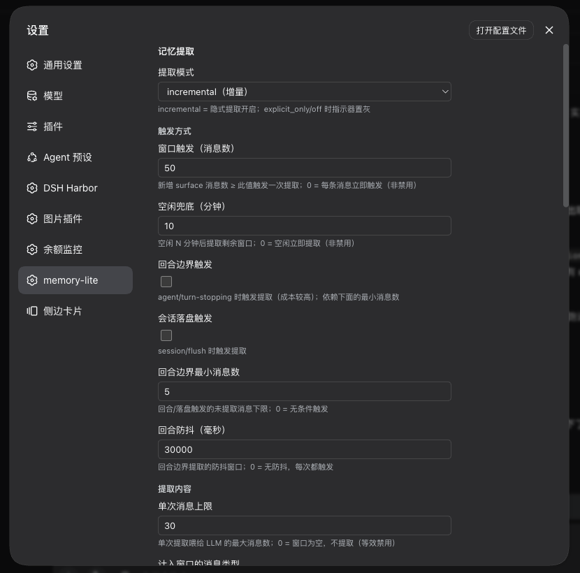
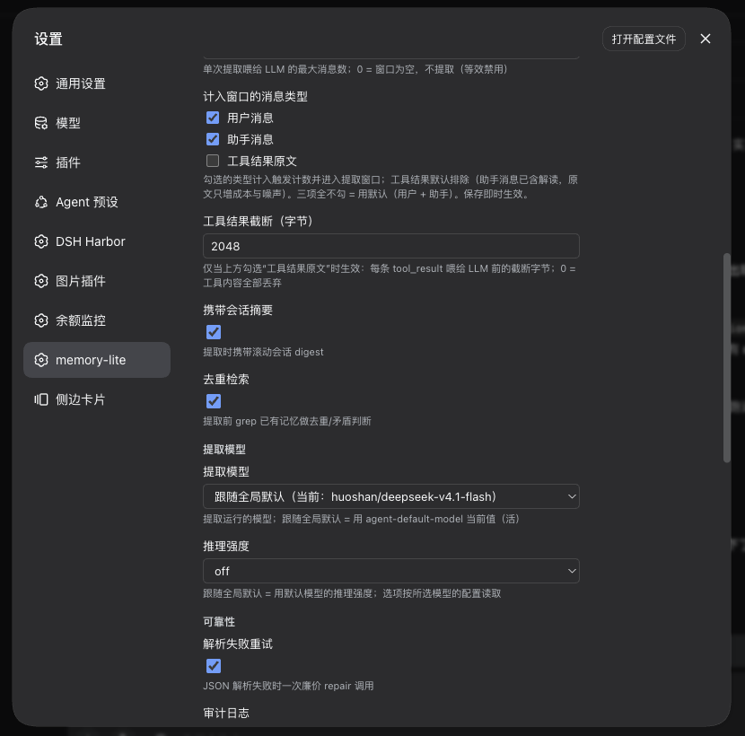

# dsh-memory-lite

[English](README.en.md) | 简体中文

**给你的 dsh agent 一份跨会话的长期记忆。** 纯 Markdown 文件、零依赖：会话里的偏好、决策、约束会被记下来，重启、升级、换 profile 之后依然在。

> dsh 的每个会话都是白纸开局 —— 转录落盘是为了审计，模型再也看不到它。这个插件补上那一层：一条常驻的记忆目录 + 5 个记忆工具 + 后台自动提取。

<p align="center">
  
</p>

## 快速开始（3 步）

```sh
# 1. 安装（= 在 profile 里 pnpm add，并自动把包加进 dsh.profile.bundles）
dsh plugin --profile web add @alanzhao/dsh-memory-lite

# 2. 重启 dsh（宿主插件与浏览器半边都在启动时加载）

# 3. 验证：见下面三条
```

装好后你应该看到：

- 会话标题栏出现 `memory-lite` 胶囊：**绿点** = 最近一次提取正常，灰 = 提取关闭，红 = 最近一次提取失败
- **设置 → memory-lite** 出现完整配置页（下图）
- 对模型说「记住：我用 pnpm 作为包管理器」，它会调用 `remember`，文件落到 `~/.agent-memory/peers/<peer>/memories/preferences/`（首次使用会自动建目录）

要求：**dsh ≥ 0.1.5**（0.2.0 起插件的 RPC 走 `/api` 共享 Fetch 路由；`connection.rpc.handle` 对第三方插件在 0.1.3-alpha.2 之后不可用），Node ≥ 22。

<p align="center">
  
</p>

## 功能

| 能力 | 说明 |
|---|---|
| 显式记忆（5 个工具） | `read_memory` / `search_memory` / `remember` / `update_memory` / `forget_memory`；`update` 把旧内容归档进 `## History`，`forget` 是软删除（进 `.trash/`） |
| L0 目录注入 | 每个会话注入一条常驻的记忆目录消息（`_index.md` 渲染）；目录变化、或压缩把它挤出可见面时自动重发 |
| 隐式提取 | 后台把新增对话窗口喂给模型，产出 create / merge / update / skip 决策，带去重检索与解析失败重试 |
| 跨 peer 共享 | 把别的 peer 的记忆以只读方式挂到 `shared/<name>/` 下 |
| 头部指示器 | 标题栏胶囊 + 三色点，每 10 秒轮询一次运行状态 |
| peer 隔离 | peer 名由会话 cwd 推导（目录名 + 短哈希），无 cwd 的会话落到 `defaultPeer` |

<p align="center">
  
</p>

## 它会花多少钱

| 时机 | 成本 |
|---|---|
| 每一步 | 5 个工具 schema 注入（约 300–800 tokens） |
| 每个会话 | L0 目录一条常驻消息，默认上限 1200 tokens；命中 KV cache 后增量接近 0 |
| 每次显式 remember | 一次工具调用；索引重建不花 LLM |
| 每次隐式提取 | **1 次 LLM 调用**（解析失败重试时 2 次），用你的默认模型或指定模型 |

默认触发条件：新增 50 条会话消息（`windowTurns`）或空闲 30 分钟（`idleTimeoutMin`）；回合边界与落盘触发默认关闭。

> **建议**：提取是结构化 JSON 任务，不需要推理。把「推理强度」设为 **off** —— 否则模型可能把输出预算全花在思考上（表现为每次跑两次、耗时 20–80 秒）。

## 配置

全部在 **设置 → memory-lite** 里改，存到 `~/.dsh/settings.yaml` 的 `dsh-memory-lite:` 段。多数字段**保存即生效**；`root` 与 `sharing.*` 需要重启。

| 分组 | 字段 | 说明 |
|---|---|---|
| 提取 | 提取模式 | `incremental`（默认，隐式提取开）/ `explicit_only` / `off` |
| 触发方式 | 窗口触发（消息数） | 新增消息数 ≥ 此值触发一次；默认 50；0 = 每条消息触发（不是禁用） |
| | 空闲兜底（分钟） | 空闲 N 分钟后提取剩余窗口；默认 30 |
| | 回合边界触发 / 会话落盘触发 | 默认关闭（成本更高） |
| | 回合边界最小消息数 / 回合防抖（毫秒） | 上面两个触发器的门槛 |
| 提取内容 | 单次消息上限 | 一次喂给模型的最大消息数；默认 20 |
| | 计入窗口的消息类型 | 默认 用户 + 助手；工具结果原文默认排除（只增成本与噪声）；三项全不勾 = 用默认 |
| | 工具结果截断（字节） | 仅勾选「工具结果原文」时生效 |
| | 携带会话摘要 / 去重检索 | 默认都开 |
| 提取模型 | 提取模型 | 默认跟随全局默认模型（活值）；也可固定到某个 provider/model |
| | 推理强度 | 按所选模型声明的强度读取；**建议 off** |
| 可靠性 | 解析失败重试 | JSON 解析失败时一次廉价 repair 调用（默认开） |
| | 审计日志 | 写 `peers/{peer}/sessions/{session-id}.json` 与 `extraction.log` |
| 目录注入 | 目录 token 上限 | L0 目录截断上限，默认 1200 |
| 界面 | 指示器位置 | 标题栏 utilities 槽顺序；保存后刷新页面生效 |
| 存储与共享 | 记忆根目录 | 默认 `~/.agent-memory`，**重启生效** |
| | 默认 peer | 无 cwd 会话的归属 |
| | 跨 peer 共享 | 总开关，**重启生效**；具体挂载在下方勾选 |

完整 schema 与默认值见 [`src/config.ts`](https://github.com/alanzhao0128/dsh-memory-lite/blob/main/src/config.ts)。

## 记忆长什么样

```
~/.agent-memory/
├── peers/{peer}/
│   ├── memories/
│   │   ├── _index.md              # L0 目录（生成；可人工编辑）
│   │   ├── preferences/  entities/  events/  experiences/
│   │   │   └── {slug}.md          # L1 全文
│   └── sessions/                  # 提取书签 + 审计 + extraction.log
└── .trash/                        # forget 的软删除（按日期分目录）
```

每个记忆文件用 `## Current` / `## History` / `## Related` 三段；更新是归档而不是覆盖。四个分类是给模型的检索路径：preferences（总是相关）、entities（被提到的事实）、events（时间相关）、experiences（任务经验）。

## 工作原理（简版）

- **目录注入**：在 `agent/pre-step` 瀑布里把 `_index.md` 渲染成一条带官方 `plugin` + `catalog` 形式的 `user/message`；子代理会话不注入。
- **提取**：按 `windowTurns` 或空闲触发 → 取窗口内消息 → grep 已有记忆去重 → 一次 LLM 决策 → 写文件 → 推进每会话书签。**失败不推进书签**，下次触发重试。
- **安全**：所有文件访问过包含边界（只允许相对路径；`..`、绝对路径、symlink 逃逸在执行层拒绝）。
- **并发**：所有写入走串行队列 + 原子替换（tmp + rename）。

细节（设计取舍、事故记录、实现偏差）在 [`IMPLEMENTATION.md`](https://github.com/alanzhao0128/dsh-memory-lite/blob/main/IMPLEMENTATION.md)。

## 故障排查

| 现象 | 处理 |
|---|---|
| 装完没反应、模型看不到记忆工具 | 必须**重启 dsh**；确认 `dsh plugin --profile web ls` 里有这个包，且 `dsh.profile.bundles` 里也有它 |
| 标题栏没有 memory-lite 胶囊 | 刷新页面；槽位在标题栏 utilities 区（位置可在设置里调） |
| 胶囊红点 | 最近一次提取失败：看 `~/.agent-memory/peers/<peer>/sessions/extraction.log` 最后一行的 `note` |
| 提取从不触发 | 依次检查：提取模式、窗口触发消息数、计入窗口的消息类型、单次消息上限（0 = 不提取） |
| 日志出现 `no configured model`，或设置页显示「已失效」 | 提取模型指向了已改名/删除的模型，重新选一个 |
| 提取很慢 / 总是 `parse-error-recovered` | 推理强度太高吃光输出预算：把「推理强度」设为 off |
| 记忆写到了别的 peer | peer 由会话 cwd 推导；无 cwd 的会话用 `defaultPeer`（设置里可改） |

## 卸载

```sh
dsh plugin --profile web remove @alanzhao/dsh-memory-lite
# 重启 dsh
```

记忆文件不会被删：`~/.agent-memory` 留着自己处理（想清空直接删目录）。

## 已知限制

- `forget_memory` 没有审批门控（模型可以直接软删除）。
- `## Related` 的自动维护还没做。
- 没有 CLI / MCP 入口。
- 浏览器半边（指示器 + 设置页）需要 web profile 的 `connection` 服务；headless profile 下插件照常加载（工具 + 提取可用），只是没有这两个界面。
- 隐式提取的质量取决于你选的模型；小模型更容易产出需要 repair 的 JSON。

## 开发

```sh
npm install
npm run build     # tsc -> lib/
npm test          # node:test + tsx（含真实 Loader 启动冒烟）
```

## License

MIT
